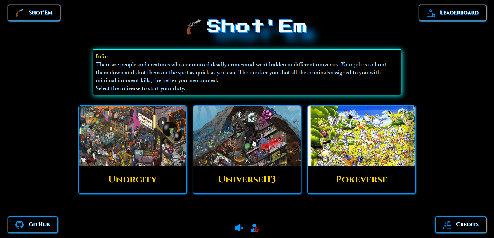
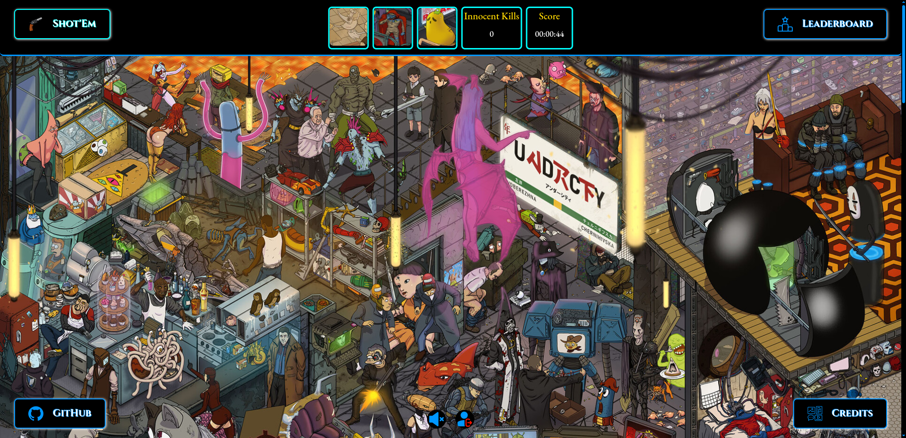
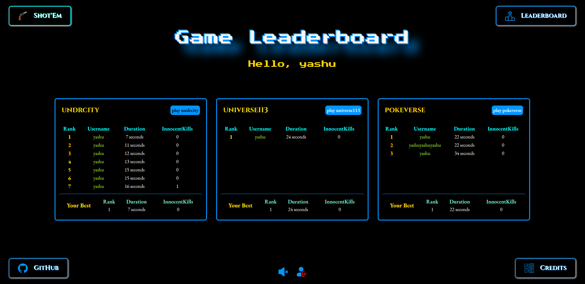
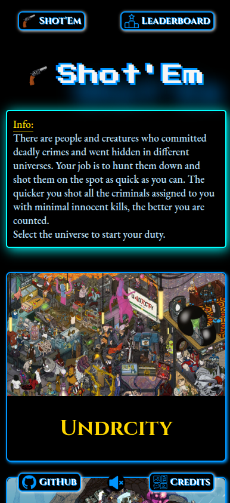
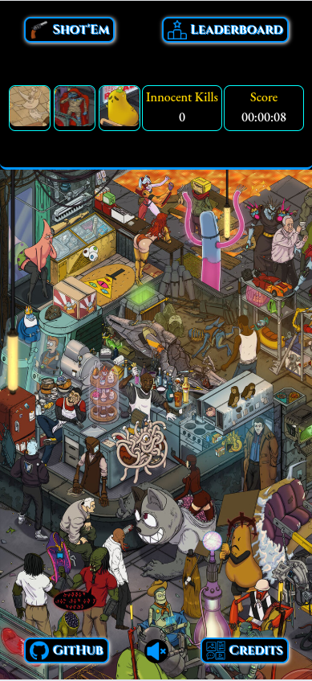
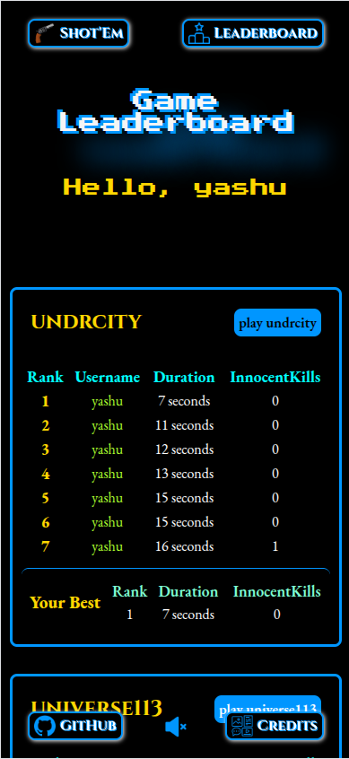

# Shot'Em Server : a game similar to Where's Waldo
## [Play Game Online](https://shotem.vercel.app/)

This repository contains code for backend server Shot'Em : a game similar to Where's Waldo where players have to search for characters from a photo containing many crowded characters. [Click here to go to Frontend Repository](https://github.com/yashulilhare/wheres-who-frontend)

## Table of contents

- [Shot'Em Server : a game similar to Where's Waldo](#shotem-server--a-game-similar-to-wheres-waldo)
  - [Table of contents](#table-of-contents)
  - [Introduction](#introduction)
    - [Features](#features)
  - [App Showcase](#app-showcase)
  - [Tech Stack](#tech-stack)
    - [Backend Stack](#backend-stack)
    - [Other used skill stack](#other-used-skill-stack)
  - [Project Structure](#project-structure)
  - [Contact](#contact)
  - [License](#license)

## Introduction

This is a full stack web based game built as a part of project submission in [The Odin Project](https://www.theodinproject.com) full stack web development curriculum. The game has 3 different images / modes with different characters, user can choose any mode they want to play. Upon selecting a mode 3 random character will be chosen from the mode and user has to find all the characters to complete the game. User can see global ranking upon Game Ending page and Leaderboard page.

### Features

- This game uses backend server to handle the game logic. Which helps in preventing cheating in scores as move calculations are handled on backend itself.
- Authenticate user using username and password.
- Use JWT for keeping active sessions and storing user credentials.
- Using REST API based backend design for score checking and resource sharing.
- Preserve players data and scores using databases.

## App Showcase

| Homepage desktop view                                           |
| --------------------------------------------------------------- |
|  |

| Game Playing view                                               |
| --------------------------------------------------------------- |
|  |

| Leaderboard desktop view                                           |
| ------------------------------------------------------------------ |
|  |

| Homepage Smartphone view                                       | Game Playing Smartphone view                                        | Leaderboard Page Smartphone View                                 |
| -------------------------------------------------------------- | ------------------------------------------------------------------- | ---------------------------------------------------------------- |
|  |  |  |

## Tech Stack

### Backend Stack

- Express
- NodeJs
- Express
- Prisma ORM
- SQL
- postgres
- PostgreSQL
- jsonWebToken
- Postman
- Express Validator

### Other used skill stack

- ESLint
- Prettier
- VS Code
- Jest
- npm
- Git
- Figma

## Project Structure

```
shotem-web-game
|-- app.js
|-- server.js
|-- package.json
|-- package.lock.json
|
|-- \controllers
|    |-- auth.js
|    |-- leaderboard.js
|    |-- playgame.js
|    |-- user.js
|
|-- \routes
|    |-- auth.js
|    |-- user.js
|    |-- playgame.js
|    |-- leaderboard.js
|
|-- \prisma
|    |-- schema.prisma
|    |-- \migrations
|
|-- \db
|    |-- populateDB.js
|    |-- initialData.js
|    |-- userQueries.js
|    |-- activeGamequeries.js
|    |-- leaderboardQueries.js
|
|-- \middlewares
|    |-- auth.middleware.js
|    |-- validate-user.js
|
|-- \lib
|    |-- prisma.js
|
|-- \utils
|    |-- characters.js
|    |-- formatCharacter.js
|    |-- formatCharacterForDB.js
|    |-- generateJWT.js
|    |-- getCharacter.js
|    |-- mode.js
|    |-- getRandomChar.js
|    |-- getRefreshToken.js
|    |-- separateCoordinates.js
|
|-- .gitignore
|-- .env
|-- README.md
|-- LICENSE
```

## Contact

- [Email](mailto:lilhareyashu@gmail.com)

## License

All rights reserved under MIT License
